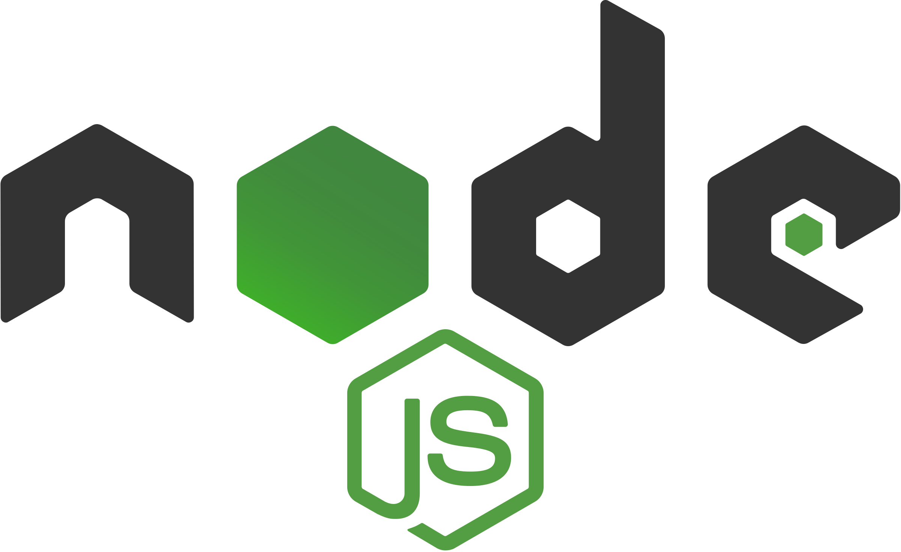

<h1>jQuery Movie App</h1>

Unlimited movies, TV shows, your favorite people and more.

- Production url: [jquery-movies.netlify.app](https://jquery-movies.netlify.app/)

## Table of Contents

- [](#)
  - [Prerequisites](#prerequisites)
- [](#-1)
  - [Tech Stack](#tech-stack)
- [](#-2)
  - [Getting Started](#getting-started)
- [](#-3)
  - [Git commit types](#git-commit-types)
  - [Project Structure](#project-structure)
- [](#-4)
  - [Resources](#resources)

#

## Prerequisites

-  <p>_Node JS @12.X and up_</p>
-  <p>_npm @6 and up_</p>

#

## Tech Stack

-  [[jQuery @3.6.1]](https://jquery.com/) - Fast, small, and feature-rich JavaScript library

-  [[tailwindcss @3.2.4]](https://tailwindcss.com/) - Open source CSS framework

-  [[axios @1.1.3]](https://axios-http.com/) - Promise based HTTP client for the browser

#

## Getting Started

1\. First of all you need to clone repository from github

```sh
git clone https://github.com/Saba-Var/jQuery-Movie-App.git
```

2\. Navigate to the repository

```sh
cd jQuery-Movie-App/
```

3\. Next step requires install all the dependencies

```sh
npm install
```

4\. Run application locally from the terminal:

```sh
npm run start
```

Open [http://127.0.0.1:8080](http://127.0.0.1:8080/) to view it in your browser.

#

## Git commit types

| type     | Description                                                           |
| -------- | --------------------------------------------------------------------- |
| fix      | fix any bugs                                                          |
| feat     | add new functionality                                                 |
| refactor | the code quality has been improved without changing the functionality |
| docs     | improvement/addition of documentation                                 |

## Project Structure

```bash
├─── assets
├─── constants
├─── css
├─── dist
├─── pages
│     ├── movies
│     │   ├── info
│     │   ├── search
│     │   ├── index.html
│     │   └── index.js
│     └── people
│         ├── info
│         ├── search
│         ├── index.html
│         └── index.js
├─── readme
│     └── assets
├─── services
├─── utils
│── .gitignore
│── .prettierrc.json
│── index.html
│── index.js
│── package.json
│── README.md
└── tailwind.config.js
```

#

## Resources

- [The Movie Database API](https://developers.themoviedb.org/3)
